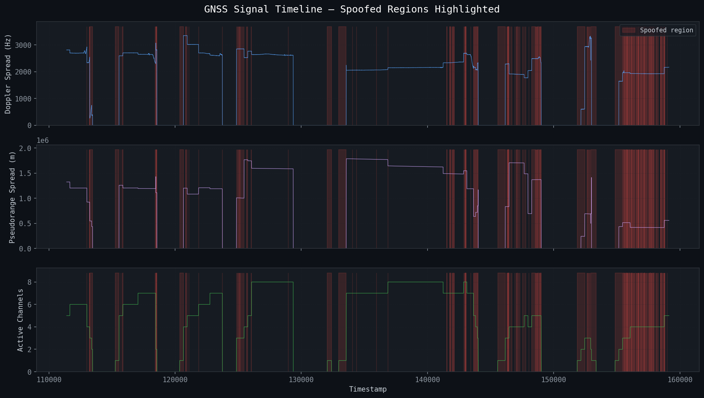
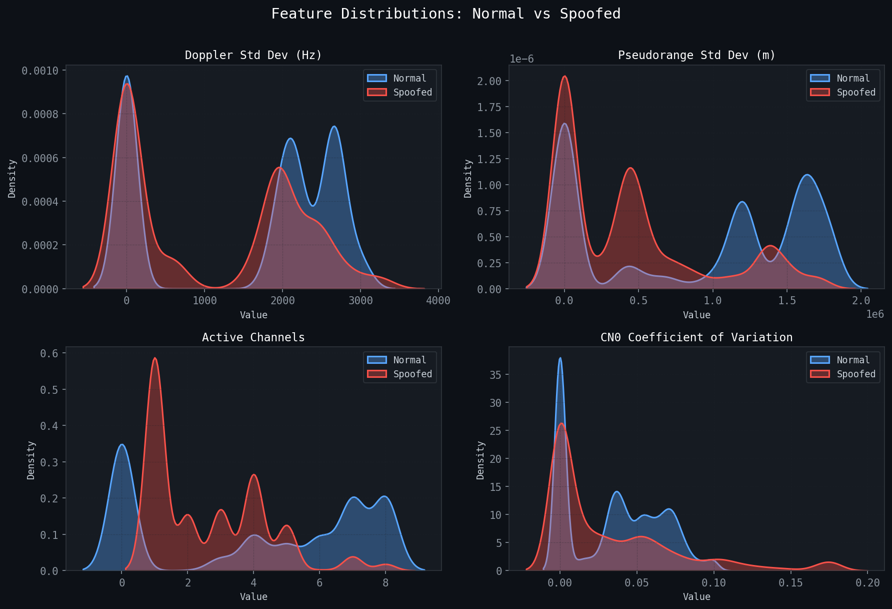
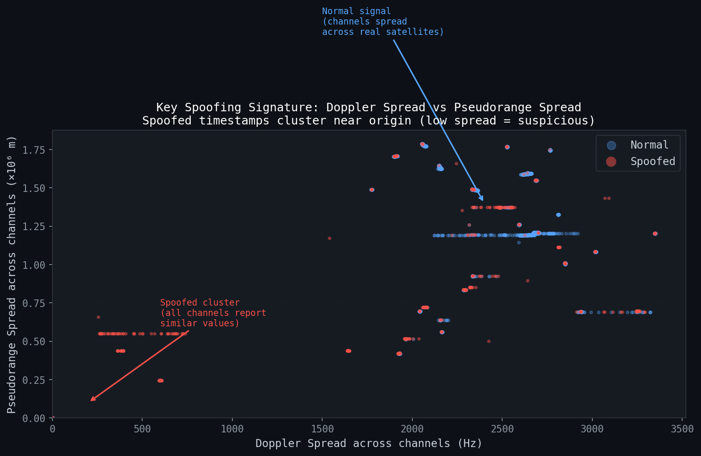
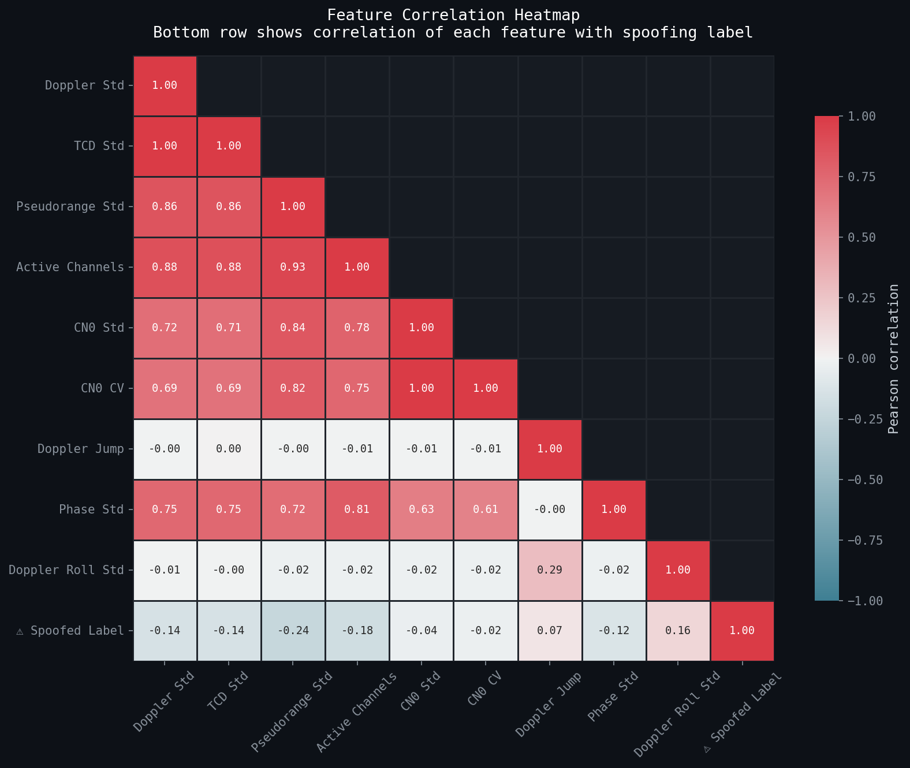
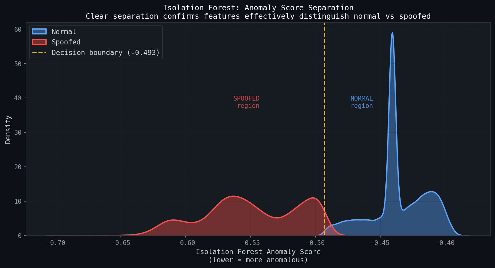
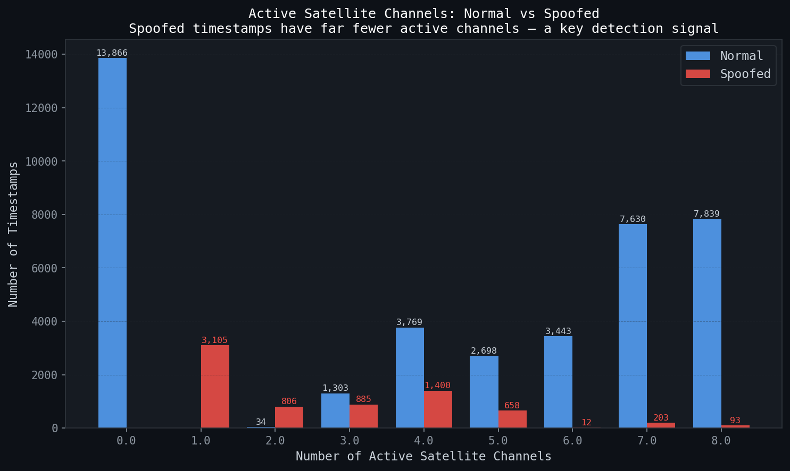
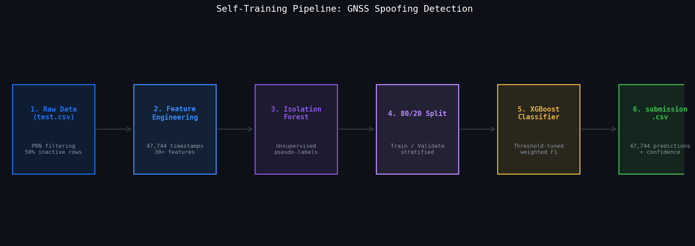

# 🛰️ GNSS Spoofing Detection  
### Physics-Aware, AI-Driven Signal Anomaly Detection Pipeline

---

## 📌 Overview

This project presents a **physics-aware anomaly detection framework** for identifying GNSS spoofing attacks.  
Unlike conventional classification pipelines, this approach models spoofing as a **violation of physical consistency across space and time**.

---

## 🧠 Problem Framing

GNSS spoofing is fundamentally a **signal integrity attack**, where adversaries attempt to replicate satellite signals.

However, spoofers fail to replicate:
- Independent satellite motion  
- True geometric diversity  
- Natural temporal evolution  
- Physical coupling between measurements  

---

## ⚙️ Feature Engineering: Signal Intelligence Layer

Features are designed to expose **latent inconsistencies** across spatial, temporal, and physical domains.

---

## 🔬 Feature Selection Rationale

### 1. Doppler Coefficient of Variation (`doppler_cv`)
- Captures satellite motion diversity  
- Spoofers produce uniform Doppler → low variation  

### 2. Active Channel Count (`active_channels`)
- Detects satellite dropout or unnatural stability  

### 3. CN0 Features (`cn0_mean`, `cn0_cv`, `cn0_high`)
- Detect overpowering and unnatural signal cleanliness  

### 4. Pseudorange Spread (`range_spread`)
- Detects unrealistic satellite geometry  

### 5. Temporal Jumps (`doppler_jump`, `phase_jump`)
- Captures spoofing takeover transitions  

### 6. Rolling Statistics
- Detect sustained anomalies over time  

### 7. Doppler–Clock Drift Ratio (`tcd_doppler_ratio`)
- Identifies violations of physical signal relationships  

---

## 🏗️ Model Architecture

### Stage 1: Isolation Forest
- Unsupervised anomaly detection  
- Generates pseudo-labels  

### Stage 2: XGBoost
- Learns non-linear relationships  
- Produces spoofing probability  

---

## 🧪 Training Strategy

- Given the absence of ground-truth labels, we adopted a pseudo-label self-training strategy. Phase 3 used unsupervised anomaly detection (Isolation Forest) to generate initial labels. Phase 4 trained a supervised XGBoost classifier on these pseudo-labels with an 80/20 train-validation split. The classification threshold was tuned on the validation split to maximize weighted F1. Feature engineering focused on temporal dynamics and cross-channel inconsistencies motivated by physical spoofing signatures.
- Removed inactive channels  
- Standardized features  
- Used pseudo-labeling  
- Handled imbalance via `scale_pos_weight`  
- Optimized threshold using Weighted F1

---

## 🚀 How to Run

Follow these steps to properly set up and run the GNSS Spoofing
Detection pipeline in accordance with the problem statement and dataset
requirements:

------------------------------------------------------------------------

### 1. Clone the Repository

``` bash
git clone <your-repo-link>
cd <repo-folder>
```

------------------------------------------------------------------------

### 2. Create Virtual Environment (Recommended)

``` bash
python -m venv venv
source venv/bin/activate      # On Mac/Linux
venv\Scripts\activate         # On Windows
```

------------------------------------------------------------------------

### 3. Install Required Libraries

Make sure you have Python ≥ 3.8 installed.

``` bash
pip install --upgrade pip
pip install numpy pandas scikit-learn xgboost matplotlib seaborn jupyter
```

------------------------------------------------------------------------

### 4. Setup Dataset

Create a `data/` directory in the root of the project:

``` bash
mkdir data
```

Place the following files inside the `data/` folder:

    data/
    │── test.csv
    │── submission_format.csv


------------------------------------------------------------------------

### 5. Verify File Access in Code

Make sure your code reads files like this:

``` python
import pandas as pd

test = pd.read_csv("data/test.csv")
submission_format = pd.read_csv("data/submission_format.csv")
```

------------------------------------------------------------------------

### 6. Run the Pipeline

``` bash
jupyter notebook
```

-   Open: `notebooks/code.ipynb`
-   Run all cells sequentially


------------------------------------------------------------------------

### 7. Generate Submission File

-   The model will generate predictions on `test.csv`
-   Output file must:
    -   Match **exact format of `submission_format.csv`**
    -   Contain correct column names
    -   Be saved as:

``` bash
submission.csv
```


------------------------------------------------------------------------

Your pipeline should now be fully reproducible and compliant with the
requirements.

## 📊 Visual Analysis & Insights

### 1. GNSS Signal Timeline (Spoofed Regions Highlighted)


This plot shows how GNSS signals evolve over time.  
Red shaded regions indicate **spoofed intervals**, where:
- Doppler spread becomes unstable or collapses  
- Pseudorange spread shows abnormal patterns  
- Active satellite channels drop sharply  

👉 Key takeaway: Spoofing introduces **temporal inconsistencies and sudden disruptions**.

---

### 2. Feature Distributions: Normal vs Spoofed


Distribution comparison of key features:
- Doppler standard deviation  
- Pseudorange variation  
- Active channels  
- CN0 coefficient of variation  

👉 Key takeaway: Spoofed signals tend to have:
- Lower diversity  
- More concentrated distributions  
- Less natural variation  

---

### 3. Doppler vs Pseudorange Spread (Key Signature)


Scatter plot showing relationship between Doppler spread and pseudorange spread.

👉 Observations:
- Normal signals are **well spread across space**  
- Spoofed signals cluster near **low spread regions**  

👉 Key takeaway: Low spread across channels is a strong indicator of spoofing.

---

### 4. Feature Correlation Heatmap


Shows correlation between engineered features and spoofing label.

👉 Key insights:
- Strong relationships between physical features  
- Certain features (e.g., active channels, spread metrics) correlate with spoofing  

👉 Helps validate feature engineering choices.

---

### 5. Isolation Forest Anomaly Scores


Distribution of anomaly scores from Isolation Forest.

👉 Observations:
- Clear separation between normal and spoofed regions  
- Threshold effectively splits the two classes  

👉 Key takeaway: Unsupervised anomaly detection is effective for this problem.

---

### 6. Active Satellite Channels Analysis


Bar chart comparing number of active channels in normal vs spoofed cases.

👉 Key insight:
- Spoofed timestamps have **significantly fewer active satellites**  

👉 This is one of the strongest detection signals.

---

### 7. Model Pipeline Architecture


Overview of the full detection pipeline:

1. Raw GNSS data  
2. Feature engineering  
3. Isolation Forest (anomaly detection)  
4. Train-validation split  
5. XGBoost classifier  
6. Final submission  

👉 Key takeaway: The system combines **unsupervised + supervised learning** for robust detection.

---


## 🎯 Final Insight

This system detects spoofing by identifying:

> Violations in spatial diversity, temporal continuity, and physical consistency

---


